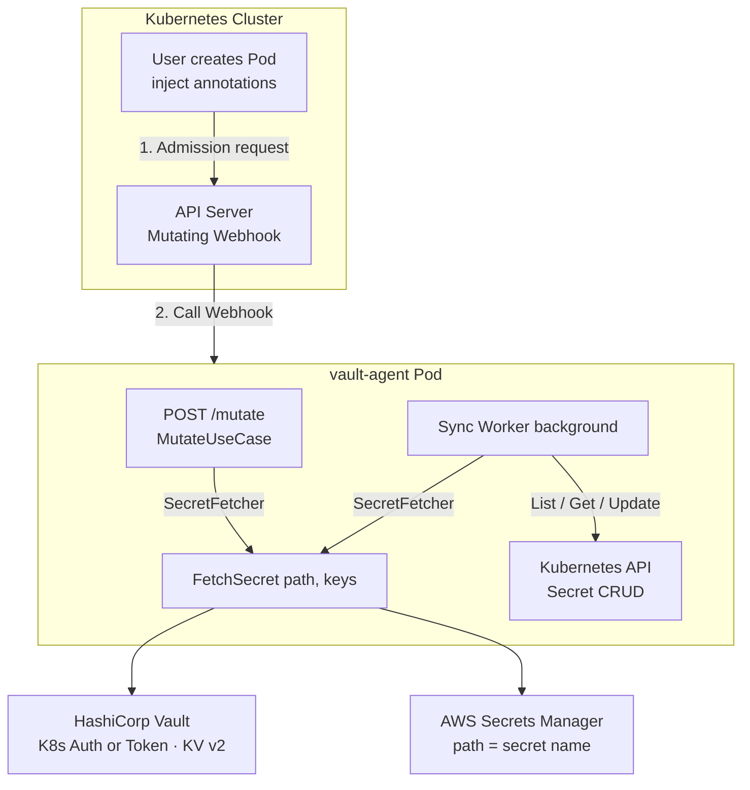
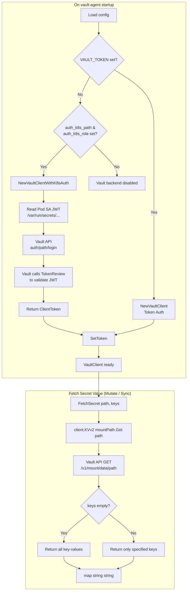
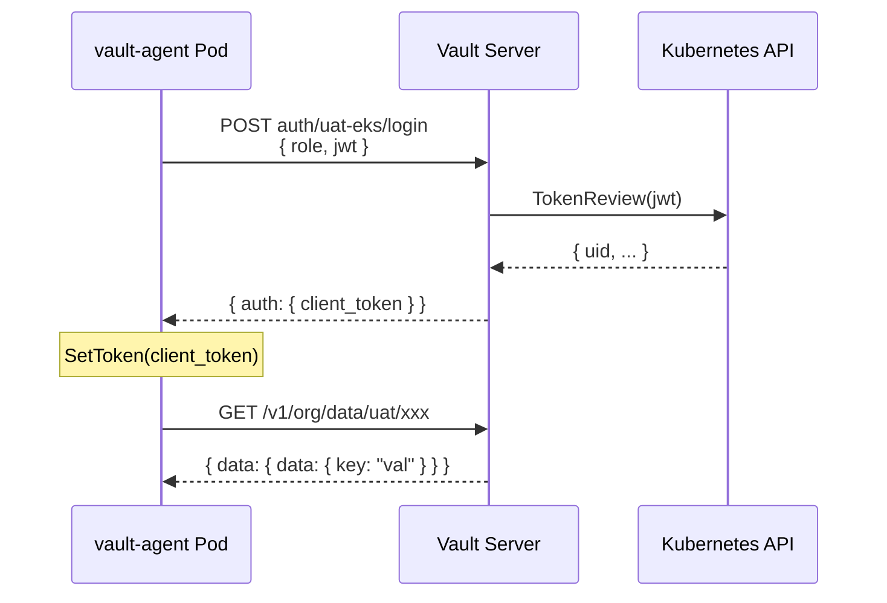

# Architecture and Flow Diagrams

- **Architecture diagram**: How vault-agent relates to Kubernetes, Vault, and AWS.
- **Flow diagrams**: Vault authentication and fetching secret values.

> 繁體中文版請見：[`architecture-diagrams.zh-Hant.md`](architecture-diagrams.zh-Hant.md)

---

## 1. Overall Architecture

---

## 2. Vault Authentication and Fetching Values

Two authentication methods for the **Vault** backend and how secret values are retrieved.

### 2.1 Flow Overview (Mermaid)

### 2.2 Token Auth Flow (Summary)

| Step | Description                                                               |
| ---- | ------------------------------------------------------------------------- |
| 1    | Config or env provides `vault.token`                                      |
| 2    | `NewVaultClient(address, token, mountPath)` and `SetToken(token)`         |
| 3    | Each `FetchSecret(ctx, path, keys)` calls Vault KV v2 API with that token |
| 4    | `client.KVv2(mountPath).Get(ctx, path)` → filter by `keys` and return     |

### 2.3 Kubernetes Auth Flow (Summary)

| Step | Description                                                                                               |
| ---- | --------------------------------------------------------------------------------------------------------- |
| 1    | Set `vault.auth_k8s_path` (Vault K8s auth mount) and `vault.auth_k8s_role` (Vault role name)              |
| 2    | `NewVaultClientWithK8sAuth(ctx, address, mountPath, authPath, role)`                                      |
| 3    | SDK reads ServiceAccount JWT from the Pod (default `/var/run/secrets/kubernetes.io/serviceaccount/token`) |
| 4    | Call Vault `POST auth/{authPath}/login` with `role` and `jwt`                                             |
| 5    | Vault uses that auth backend's `token_reviewer_jwt` to call Kubernetes TokenReview API                    |
| 6    | On success, Vault issues `ClientToken` according to the role's policies                                   |
| 7    | vault-agent calls `SetToken(ClientToken)`; from then on, same as token auth                               |
| 8    | `FetchSecret(ctx, path, keys)` uses this token to call KV v2 API and return values                        |

### 2.4 Sequence (K8s Auth)

---

## 3. Config Mapping

| Auth method | Config fields                                                                     | Notes                                                                                               |
| ----------- | --------------------------------------------------------------------------------- | --------------------------------------------------------------------------------------------------- |
| Token       | `vault.address`, `vault.token`, `vault.mount_path`                                | Static token; suitable for local or test                                                            |
| Kubernetes  | `vault.address`, `vault.auth_k8s_path`, `vault.auth_k8s_role`, `vault.mount_path` | Recommended for production; Vault must be set up per [Vault Server Setup](vault-server-setup.en.md) |

Vault must have Kubernetes auth enabled, policies written, and a role bound to the service account/namespace before vault-agent's Kubernetes auth can succeed.
