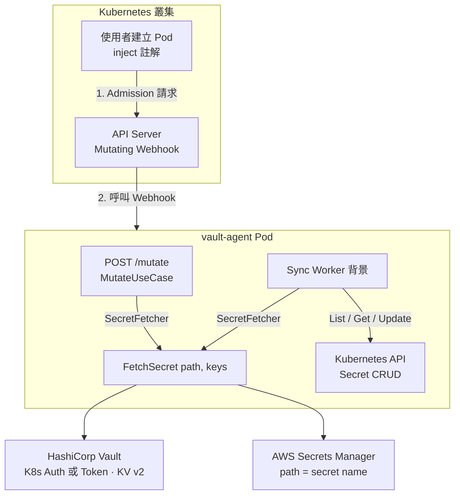
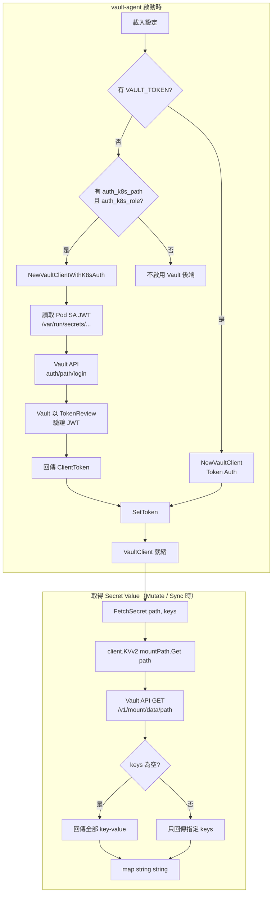
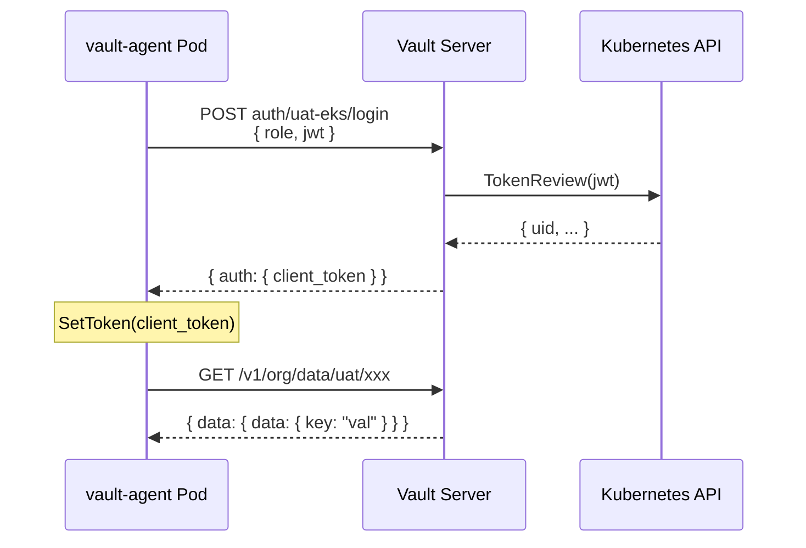

# 架構圖與流程圖

- **架構圖**：vault-agent 與 Kubernetes、Vault、AWS 的關係。
- **流程圖**：Vault 認證方式與從 Vault 取得 secret value 的流程。

> 英文版請見：[`architecture-diagrams.en.md`](architecture-diagrams.en.md)

---

## 1. 整體架構圖

---

## 2. Vault 認證與取得 Value 流程圖

以下為 **Vault 後端**的兩種認證方式，以及取得 secret 資料的流程。

### 2.1 流程概觀（Mermaid）

### 2.2 Token 認證流程（簡化）

| 步驟 | 說明                                                                               |
| ---- | ---------------------------------------------------------------------------------- |
| 1    | 設定檔或環境變數提供 `vault.token`                                                 |
| 2    | `NewVaultClient(address, token, mountPath)` 建立 client 並 `SetToken(token)`       |
| 3    | 之後每次 `FetchSecret(ctx, path, keys)` 直接呼叫 Vault KV v2 API                   |
| 4    | `client.KVv2(mountPath).Get(ctx, path)` → 取得 `secret.Data`，再依 `keys` 篩選回傳 |

### 2.3 Kubernetes 認證流程（簡化）

| 步驟 | 說明                                                                                                 |
| ---- | ---------------------------------------------------------------------------------------------------- |
| 1    | 設定 `vault.auth_k8s_path`（Vault 內 K8s auth mount 路徑）、`vault.auth_k8s_role`（Vault role 名稱） |
| 2    | `NewVaultClientWithK8sAuth(ctx, address, mountPath, authPath, role)`                                 |
| 3    | SDK 從 Pod 內讀取 ServiceAccount JWT（預設 `/var/run/secrets/kubernetes.io/serviceaccount/token`）   |
| 4    | 呼叫 Vault `POST auth/{authPath}/login`，body 含 `role` 與 `jwt`                                     |
| 5    | Vault 使用該 auth 設定的 `token_reviewer_jwt` 呼叫 K8s TokenReview API 驗證此 JWT                    |
| 6    | 驗證通過後 Vault 依 role 綁定的 policy 簽發 `ClientToken`                                            |
| 7    | vault-agent 對 client `SetToken(ClientToken)`，之後與 Token 認證相同                                 |
| 8    | 之後 `FetchSecret(ctx, path, keys)` 使用此 token 呼叫 KV v2 API 取得 value                           |

### 2.4 時序概念（K8s Auth）

---

## 3. 與設定檔對應

| 認證方式   | 設定欄位                                                                          | 說明                                                                        |
| ---------- | --------------------------------------------------------------------------------- | --------------------------------------------------------------------------- |
| Token      | `vault.address`, `vault.token`, `vault.mount_path`                                | 靜態 token，適合本機或測試                                                  |
| Kubernetes | `vault.address`, `vault.auth_k8s_path`, `vault.auth_k8s_role`, `vault.mount_path` | 生產建議，Vault 需先完成 [Vault Server 設定](vault-server-setup.zh-Hant.md) |

Vault Server 端需先啟用 Kubernetes Auth、撰寫 policy、建立 role 綁定 SA/namespace，vault-agent 的 K8s 認證才會成功。
